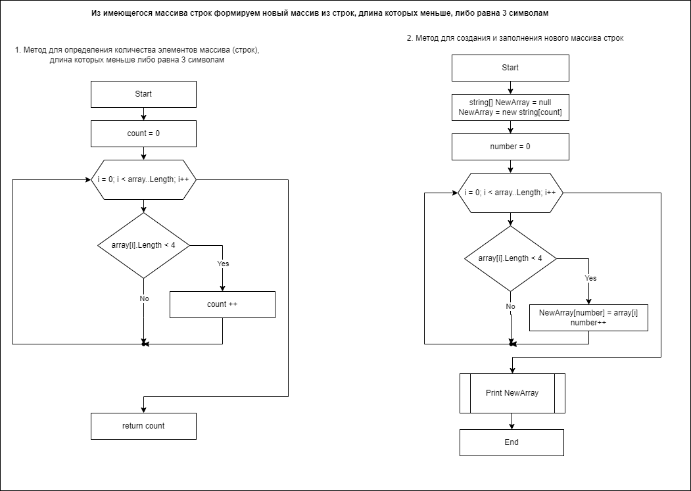

# control_work
Итоговая контрольная работа по основному блоку
Урок 1. Контрольная работа
Для полноценного выполнения проверочной работы необходимо:
1. Создать репозиторий на GitHub - выполнено
2. Нарисовать блок-схему алгоритма - выполнено:   [Ссылка на блок-схему на Гугл-диске](https://drive.google.com/file/d/1IQK03IzRtGJMBefa3IRg87cMh3B_2pty/view?usp=sharing)
3. Снабдить репозиторий оформленным текстовым описанием решения (файл README.md) - выполнено (описание ниже)
4. Написать программу, решающую поставленную задачу
5. Использовать контроль версий в работе над этим небольшим проектом (не должно быть так, что всё залито одним коммитом, как минимум этапы 2, 3, и 4 должны быть расположены в разных коммитах)

**Задача**: _Написать программу, которая из имеющегося массива строк формирует новый массив из строк, длина которых меньше, либо равна 3 символам. Первоначальный массив можно ввести с клавиатуры, либо задать на старте выполнения алгоритма. При решении не рекомендуется пользоваться коллекциями, лучше обойтись исключительно массивами._

Примеры:
[“Hello”, “2”, “world”, “:-)”] → [“2”, “:-)”]
[“1234”, “1567”, “-2”, “computer science”] → [“-2”]
[“Russia”, “Denmark”, “Kazan”] → []

## Текстовое описание рашения
Используемые методы:
* задание исходного массива -  CreateArray;
* вывод массива на экран - PrintArray;
* подсчёт количества элементов (строк) в исходном массиве с длиной не более 3 символов - CountingNum;
* формирование нового массива из существующего - MakeArray.

## Задание исходного массива
Элементы исходного массива *StrArray* задаются явным образом через присваивание.

## Подсчёт количества элементов (строк) с длиной не более 3 символов в исходном массиве 
Для того, чтобы создать новый массив, надо узнать количество элементов, из которых он будет состоять. Для решения этой задачи используем метод *CountingNum*, которому передаётся исходный массив *StrArray*. Этот метод возвращает количество элементов (*count*), удовлетворяющих заданному условию (длина строки меньше, либо равна 3 символам). Первоначальное значение *count* = 0, при каждом нахождении элемента массива (строки), имеющего длину не более 3 символов, *count* увеличивается на 1. Для перебора элементов массива используется цикл *for*.

## Формирование нового массива из существующего
Инициализируем новый пустой массив строк *NewStrArray* с количеством элементов *count*, найденном с помощью метода *CountingNum*. Для формирования нового массива в цикле for перебираем все элементы исходного массива, если количество символов текущего элемента исходного массива не превышает 3 (т.е. меньше 4), то данный элемент заносится в новый массив *NewStrArray*.

## Вывод массива на экран
Для вывода элементов массива на экран используем метод *PrintArray*, в котором с помощью цикла *for* выводим в строку элементы массива через запятую с пробелом.

